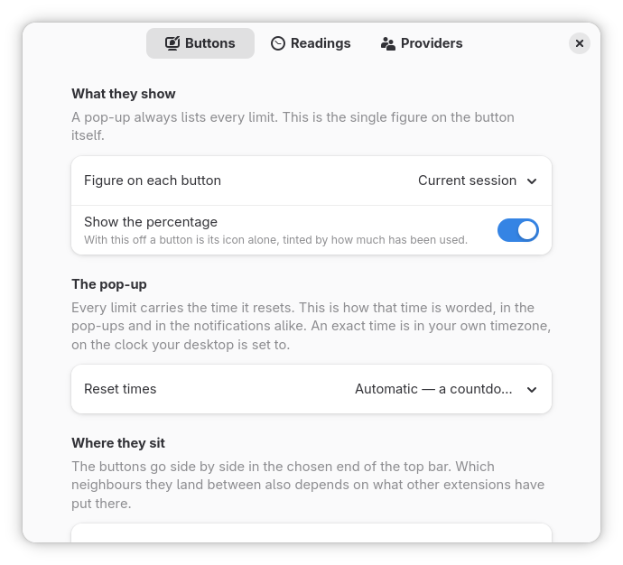
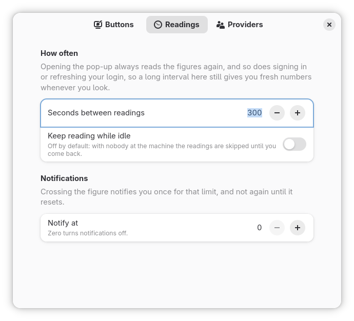
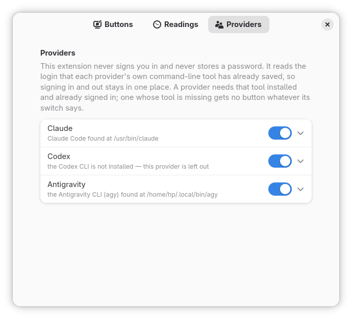

# AI Usage

Shows how much of your AI subscriptions' rate limits you have used, as a button in the
top bar: the current session, the week, and the week for each model, with the time each
one resets.


## What it does

- **A button per subscription**, carrying an icon of its own and the percentage of its
  current session used: a light bulb for Claude, a pencil for Antigravity, a terminal for
  Codex. It turns amber at 80% and red at 95%, and both figures can be
  changed.
- **Every limit in one pop-up**: the session, the week and the week for each model, each
  with a bar and the time it resets, plus paid extra usage and where the week's usage
  went, when the provider reports them.
- **The provider's own figures**, from the request its command-line tool makes for its
  own usage command, so the top bar and the terminal agree.
- **Fresh when you look**: a reading every five minutes, skipped while the session is
  idle, and again when you open a pop-up whose figures are over a minute old.
- **An optional notification** when a limit crosses a figure you choose, once per limit
  until it resets (or once more after the screen is unlocked).
- **Your choice of figure and place**: the session, the week or whichever is highest, at
  the left, centre or right of the top bar.


## You never sign in here

This extension never asks for a password and never signs you in or out. It reads the
login that your provider's command-line tool has already stored, so that tool has to be
installed and signed in, and a provider whose tool is not installed gets no button. It
never refreshes a login either: if the stored login has expired, the button is hidden
until you run the tool once, which refreshes it (or, with "Hide a button with nothing to
show" off, it turns amber and the pop-up asks you to).

## Providers

| Provider | Needs | Status |
| --- | --- | --- |
| Claude | Claude Code (`claude`), signed in | Working, verified against a live account |
| Antigravity | the Antigravity CLI (`agy`), signed in | Working, verified against a live account |
| Codex | the Codex CLI (`codex`), signed in with ChatGPT | Working, verified against a live free-plan account (codex-cli 0.160.0, 2026-10-02); the paid plans' windows are read as openai/codex's source describes them |

Each provider is switched on or off in the preferences, and offered only the switches it
can honour: per-model limits, where the usage went, extra usage.

## Requirements

- GNOME Shell 50.
- The command-line tool of each provider you want, signed in, and on the `PATH` that
  GNOME Shell was started with.
- libsecret's introspection data, which GNOME normally has already (Debian and Ubuntu:
  `gir1.2-secret-1`). The Antigravity CLI keeps its login in the system keyring.

## Privacy and network

On every reading, for each provider switched on, the extension reads the stored login and
sends it to that provider's own server, the same request the provider's tool makes:

| Provider | Reads | Sends it to |
| --- | --- | --- |
| Claude | `~/.claude/.credentials.json`, and the plan name from `~/.claude.json` | `api.anthropic.com` |
| Antigravity | the login in the system keyring, or `~/.gemini/antigravity-cli/antigravity-oauth-token` | `cloudcode-pa.googleapis.com` |
| Codex | `auth.json` in `$CODEX_HOME`, or `~/.codex/auth.json` | `chatgpt.com` |

Nothing else goes anywhere. The extension never writes to these files, never keeps a
token between readings and never logs one. What it stores is its own settings, in
dconf. These are the endpoints the tools themselves use, not published APIs, so a
provider may change them; the button then says the usage could not be read.

## Install

It is not on extensions.gnome.org yet. From source, with `make`, `glib-compile-schemas`
and `gnome-extensions`:

```sh
git clone https://github.com/Jackicus/GNOME-AI-Usage
cd GNOME-AI-Usage
make install
```

Then **log out and back in** (a Wayland session cannot load an extension it has never
seen), and:

```sh
gnome-extensions enable ai-usage@jackicus
```

To update, `git pull && make install`, then log out and back in. To remove it,
`make uninstall`.

## Preferences

`gnome-extensions prefs ai-usage@jackicus` opens them, as does the arrow in any pop-up.

| Buttons | Readings | Providers |
| --- | --- | --- |
|  |  |  |

- **Buttons**: the figure each button carries, whether the percentage is shown beside the
  icon, how reset times are worded, which end of the top bar the buttons sit in and
  where, and the figures at which they turn amber and red.
- **Readings**: seconds between readings (60 to 3600), and the figure at which a limit
  notifies you (0 for never).
- **Providers**: each provider's switch, the icon its button carries, where its tool was
  found, and what its pop-up lists.

## Troubleshooting

Follow the shell's log while you reproduce the problem:

```sh
journalctl -f -o cat /usr/bin/gnome-shell | grep -i 'ai usage'
```

and for the preferences window, which is its own process:

```sh
journalctl -f -o cat SYSLOG_IDENTIFIER=org.gnome.Shell.Extensions
```

From a clone, `make status` says whether it is installed and what state the running
shell has it in, `make logs` follows the log, and `make providers` runs the provider code
outside the shell and prints what each button would show. That last one reads your
stored logins and goes online, just as the buttons do.

- **A provider has no button**: its tool is not on the `PATH` GNOME Shell started with,
  or its switch is off. A tool installed into a directory your terminal adds to `PATH`
  may not be on the session's.
- **A button has gone**: with "Hide a button with nothing to show" on (the default), a
  provider that is signed out, whose stored login has expired or that could not be read
  has no button. The tools refresh their logins only while they run, so use the tool
  (`claude`, `agy` or `codex`) and the button returns. With the option off the button is
  amber with no figure instead.
- **The button is amber with no figure**: the stored login has expired or is missing.
  Run the tool once (`claude`, `agy` or `codex`), signing in if it asks; a new Claude or
  Codex login is picked up within seconds, and any provider's on the next reading or when you open its pop-up.
- **No button at all after installing**: log out and back in, then
  `gnome-extensions enable ai-usage@jackicus`.

## Development

`make link` installs a link to `src/`, `make reload` loads your edits, `make nested` runs
the extension in a nested GNOME Shell with settings of its own (`make nested-stop` stops
it), `make shots` retakes the screenshots, and `make check` is what CI runs. See
[CONTRIBUTING.md](CONTRIBUTING.md), and [CLAUDE.md](CLAUDE.md) for the design: where the
figures come from, what each file is for, and how to add a provider.

## Licence

GPL-2.0-or-later. See [LICENSE](LICENSE).

## Credits and trademarks

Claude is a trademark of Anthropic, Antigravity of Google, and Codex and OpenAI of
OpenAI. The names are used only to say which service a figure belongs to; this extension
is not affiliated with or endorsed by any of them. No logo or mark of theirs ships: the
buttons use generic icons from GNOME's Adwaita icon theme, and the fallback gauge is the
extension's own.

The plans, figures and paths in the screenshots are invented: they come from stand-in
logins and answers in a nested shell (`./scripts/nested.sh shots`), not from anyone's
account.
